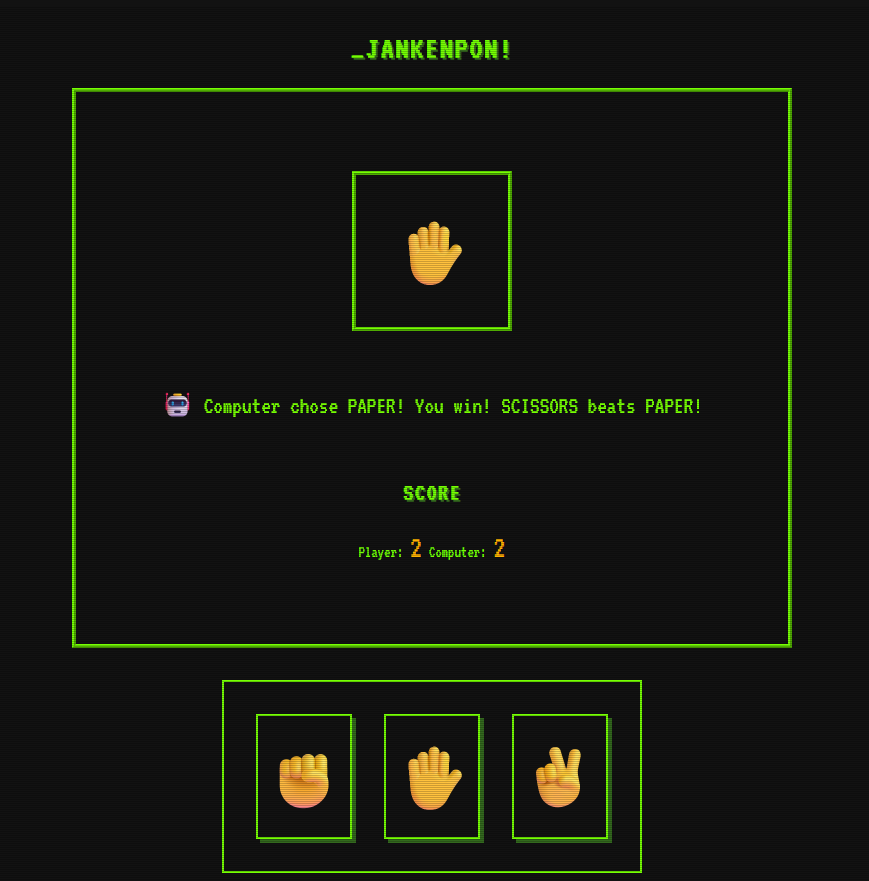

# rock-paper-scissors

> Este projeto é um jogo clássico de pedra, papel e tesoura.

## 🚀 Live Preview

**[Clique aqui para testar o projeto](https://elvismourab.github.io/rock-paper-scissors/)**

## 📖 Descrição

Este projeto faz parte do currículo do [The Odin Project](https://www.theodinproject.com). O objetivo é aplicar os aprendizados sobre HTML, CSS e JavaScript.

[Project: Rock Paper Scissors](https://www.theodinproject.com/lessons/foundations-rock-paper-scissors)

## ✨ Funcionalidades
- Escolha uma das opções na parte inferior da página, o computador também fará sua escolha. Ganha quem completar 5 pontos primeiro! Para reiniciar basta escolher uma das opções novamente.

## 🛠️ Tech Stack
- HTML
- CSS
- JavaScript

## 🧠 O que aprendi

- Estrutura básica HTML para uma web page.
- CSS (flexbox).
- Manipulação do DOM, event handling, aplicação da lógica do jogo usando JavaScript.

## 💻 Como Executar Localmente

1. Clone o repositório.
2. Entre no diretório.
3. Abra o `index.html` no navegador.
